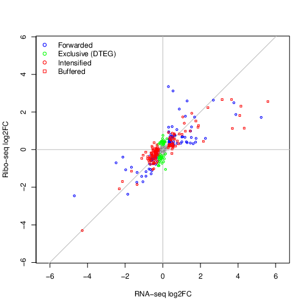

.. _tutorial_hipsc:

Run the TE pipeline
===================

For this tutorial, we use the *hiPSC-CM-chr1-example* with the *hiPSC-CM-test.yaml* configuration file.

How to run the pipeline
-----------------------

To run the pipeline, change the paths in the configuration file to point to the location where you extracted the data, *e.g.* */home/user/data/hiPSC-CM-chr1-example*. You can do this using a text editor, or simply by modifying the file in place

.. code-block:: bash

    sed -i 's|/path/to/your/hiPSC-CM-example|'`pwd`'|g' hiPSC-CM-test.yaml

.. important::

    Default parameters were modified for the example and included in the configuration file. If you use this configuration file as a general template for your data, do not forget to remove everything below the line "REMOVE BELOW THIS LINE IF YOU USE THIS CONFIGURATION FILE AS TEMPLATE FOR YOUR DATA".

For the example, you don't have to create the indices and annotation, they are included with the input data. Finally, run the abundance estimation pipeline from the *hiPSC-CM-chr1-example* directory (or adjust the paths accordingly)

.. code-block:: bash

   run-htseq-workflow \
    ribo \
    hiPSC-CM-test.yaml \
    --run-all \
    --trim-rna-to-max-fragment-size \
    --ribo-config hiPSC-CM-test.yaml \
    --star-options "--quantMode GeneCounts" \
    --htseq-options "--idattr orf_id" "--additional-attr orf_type" "--additional-attr gene_name" "--stranded yes" \
    --rna-stranded reverse \
    --gtf input/ribo-ORFs.chr1.gtf \
    --rna-config hiPSC-CM-test.yaml \
    --num-cpus 4 \
    --keep-intermediate-files \
    --logging-level INFO \
    --log-file ribotools-pipeline.log

If you have access to a cluster with a cluster management and job scheduling system such as `Slurm <https://slurm.schedmd.com/>`_, you can ``--use-slurm`` and pass additional options.

The file *ribotools-pipeline.log* contains logging output for the different processing steps. You now have two new directories *riboseq-results* and *rnaseq-results*, each with five sub-directories: a directory called *without-adapters* (Flexbar output), directories called *with-rrna* and *without-rrna* (Bowtie2 output), a directory called *without-rrna-mapping* (STAR output), and a directory called *count-tables* (final output from HTSeq). Under *riboseq-results*, there is one additional directory called *metagene-profiles* containing model outputs for periodicity estimation, periodic lengths and offsets.

How to estimate TE
------------------

Prepare the sample table

.. code-block:: bash

   get-sample-table hiPSC-CM-test.yaml

You should have a new directory, called *tea-results*, containing the file *sample-table.csv*. Finally, fit the data with

.. code-block:: bash

   run-tea --orfCol 2 --symbolCol 3 --lfcThreshold 0 --alpha .99 hiPSC-CM-test.yaml

Under *tea-results*, there is now a new sub-directory containing the output of the *LRT* model for the contrast *d5_vs_d1*. The different classes of regulated ORFs are show below

.. note::

   The test dataset contains only a subset of the original data. Values for ``--lfcThreshold`` and ``--alpha`` are not meaningful and only
   meant to produce a sufficient number of features in each class. Despite this, we are able to see features associated with relevant
   cardiac maturation regulatory processes.
